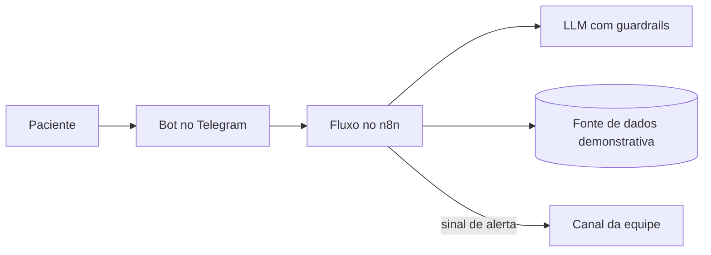

# OrtoGuide — conceito de triagem ortopédica assistida por IA 🏥

Documentação conceitual de um assistente virtual para acolhimento e educação de pacientes ortopédicos, com foco inicial no SUS em Curitiba. A proposta combina automação, linguagem natural e encaminhamento de alertas para apoiar — nunca substituir — a avaliação humana.

> **Estado do projeto:** conceito de arquitetura e fluxo. Este repositório não contém uma aplicação clínica pronta, validada ou autorizada para uso com pacientes.

## Problema

Durante a espera por atendimento, pacientes podem ter dúvidas ou relatar piora dos sintomas. O OrtoGuide propõe um canal de orientação geral que identifica relatos potencialmente críticos e encaminha um alerta para a equipe responsável.

## Arquitetura proposta

- **Interface:** Telegram Bot API.
- **Orquestração:** n8n e webhooks.
- **Processamento de linguagem:** Llama 3 via Groq API, com limites de atuação definidos no prompt.
- **Dados demonstrativos:** Google Sheets API.
- **Alertas:** canal separado para a equipe responsável.

## Fluxos previstos

- identificação do paciente em uma base demonstrativa;
- orientações gerais sobre etapas do atendimento;
- observação de termos associados a sinais de alerta;
- encaminhamento do relato à equipe humana;
- separação entre o canal do paciente e o canal interno.

## Limites de segurança

- Não fornece diagnóstico, prognóstico ou prescrição.
- Não promete prioridade ou tempo de atendimento.
- Um alerta automatizado não confirma uma condição clínica.
- Todo caso precisa ser avaliado por profissional habilitado.
- Dados pessoais e de saúde exigem base legal, minimização, controle de acesso, retenção definida e demais medidas previstas na LGPD.
- Qualquer uso real dependeria de validação clínica, jurídica, de segurança e institucional.

## Próximas etapas para um protótipo

1. Criar um fluxo n8n exportável usando apenas dados fictícios.
2. Versionar exemplos de mensagens sem informações pessoais.
3. Documentar o modelo de ameaças e os controles de acesso.
4. Adicionar testes para respostas proibidas e falsos positivos.
5. Medir qualidade, latência e taxa de encaminhamento em ambiente controlado.

## Aviso

Este material é educacional e não é um dispositivo médico. Em uma emergência, procure imediatamente o serviço de saúde apropriado.
